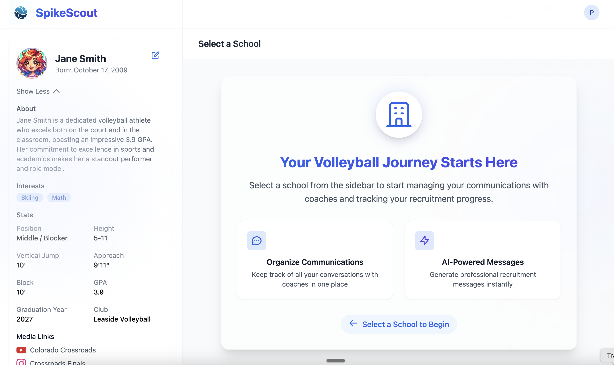
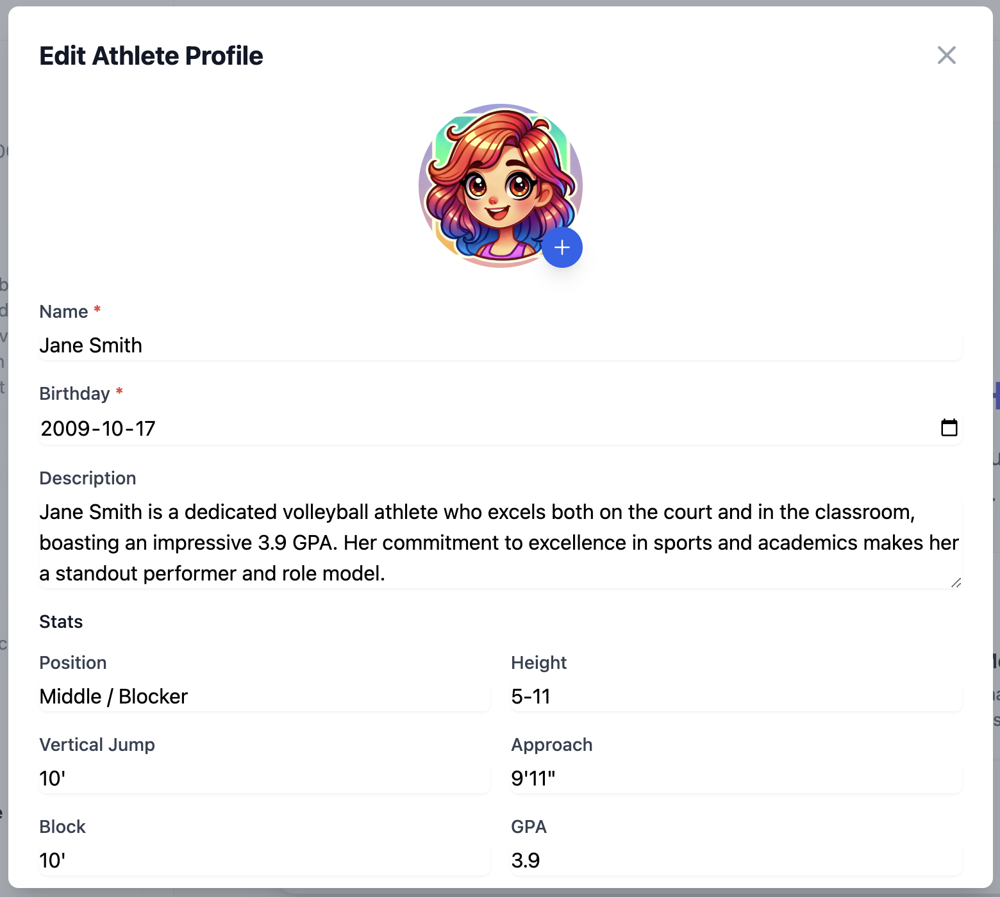
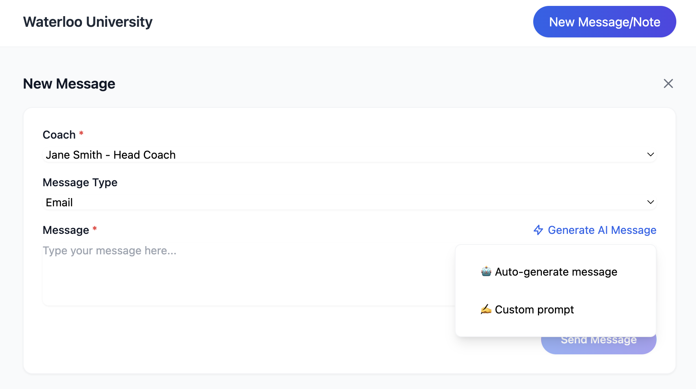

# SpikeScout - Volleyball Recruitment CRM

SpikeScout is a comprehensive Customer Relationship Management (CRM) system designed specifically for volleyball athletes managing their college recruitment process. Built with Next.js 14, TypeScript, and Firebase, it helps athletes track communications with coaches, manage school information, and streamline the recruitment journey.

## Screenshots

> Note: To add screenshots of your application, save them in the `docs/images/` directory with the following names:
> - `dashboard.png` - Main dashboard view
> - `athlete-profile.png` - Athlete profile page
> - `message-generation.png` - AI message generation interface
> 
> Then remove this note, and the screenshots will appear below.

<div align="center">
  
  <p><em>Main Dashboard - School and Communication Management</em></p>
  
  
  <p><em>Athlete Profile Management</em></p>
  
  
  <p><em>AI-Powered Message Generation</em></p>
</div>

## Features 

- **School Management**
  - Add and track potential schools
  - Store detailed information about volleyball programs
  - Tag and categorize schools based on recruitment status
  - Track program details, athletic information, and personal notes

- **Coach Communication**
  - Manage coach contacts for each school
  - Track all communications with coaches
  - Organize email, phone, and visit interactions
  - AI-powered message generation for professional communications

- **Athlete Profile**
  - Create and maintain detailed athlete profiles
  - Track key statistics and achievements
  - Store media links (YouTube, Instagram, Hudl)
  - Manage academic and athletic information

- **Smart Features**
  - AI-assisted message generation for coach communications
  - Automated message organization
  - Real-time updates and synchronization
  - Intuitive dashboard interface

## Tech Stack

- **Frontend**
  - Next.js 14 (App Router)
  - TypeScript
  - Tailwind CSS
  - React
  - Vercel AI SDK

- **Backend**
  - Firebase Authentication
  - Firebase Firestore
  - Firebase Storage
  - Firebase Security Rules

- **AI/ML**
  - Replicate API (LLaMA 2)
  - Anthropic Claude (optional)
  - OpenAI (optional)

## Getting Started

1. **Prerequisites**
   ```bash
   Node.js 18+ (LTS recommended)
   npm or yarn
   Git
   ```

2. **Installation**
   ```bash
   # Clone the repository
   git clone https://github.com/popand/spikescout.git

   # Navigate to project directory
   cd spikescout

   # Install dependencies
   npm install
   ```

3. **Environment Setup**
   Create a `.env.local` file in the root directory with the following variables:
   ```env
   NEXT_PUBLIC_FIREBASE_API_KEY=your_api_key
   NEXT_PUBLIC_FIREBASE_AUTH_DOMAIN=your_auth_domain
   NEXT_PUBLIC_FIREBASE_PROJECT_ID=your_project_id
   NEXT_PUBLIC_FIREBASE_STORAGE_BUCKET=your_storage_bucket
   NEXT_PUBLIC_FIREBASE_MESSAGING_SENDER_ID=your_sender_id
   NEXT_PUBLIC_FIREBASE_APP_ID=your_app_id
   REPLICATE_API_TOKEN=your_replicate_token
   ```

4. **Run Development Server**
   ```bash
   npm run dev
   ```
   Open [http://localhost:3000](http://localhost:3000) in your browser.

## Project Structure

```
src/
├── app/
│   ├── api/            # API routes
│   ├── components/     # React components
│   ├── lib/           # Utilities and helpers
│   │   ├── firebase/  # Firebase configuration
│   │   ├── hooks/     # Custom React hooks
│   │   ├── contexts/  # React contexts
│   │   └── types.ts   # TypeScript types
│   ├── layout.tsx     # Root layout
│   └── page.tsx       # Main dashboard
```

## Key Features Implementation

### Authentication
- Google Sign-In integration
- Protected routes and data
- User session management

### Data Management
- Real-time data synchronization
- Secure data access with Firebase Rules
- Efficient data querying and filtering

### User Interface
- Responsive design
- Modern UI with Tailwind CSS
- Interactive components
- Real-time updates

## Security

- Firebase Security Rules implementation
- User data isolation
- Secure API endpoints
- Environment variable protection

## Contributing

1. Fork the repository
2. Create your feature branch (`git checkout -b feature/AmazingFeature`)
3. Commit your changes (`git commit -m 'Add some AmazingFeature'`)
4. Push to the branch (`git push origin feature/AmazingFeature`)
5. Open a Pull Request

## License

This project is licensed under the MIT License - see the LICENSE file for details.

## Acknowledgments

- Next.js team for the amazing framework
- Vercel for deployment and AI SDK
- Firebase for backend services
- Replicate for AI capabilities